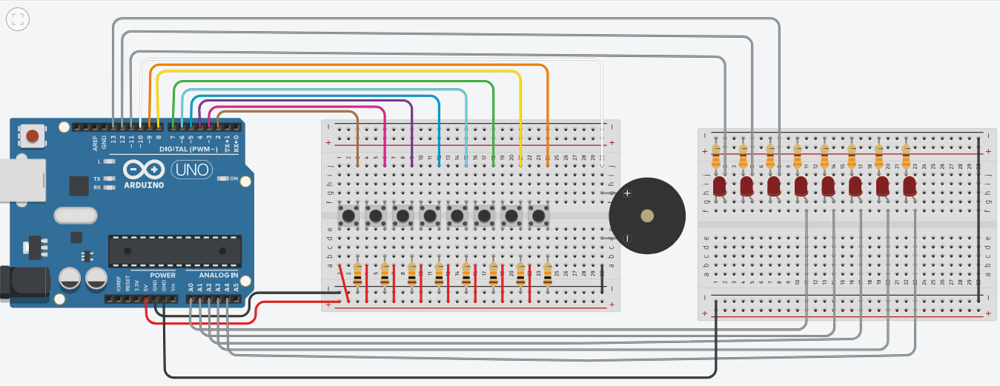

# Piano Tutor
- O projeto é um piano com o objetivo de ensinar a tocar músicas caso não tenha nenhuma experiência com notas musicais. 
- Com luzes de LED guiando o usuário, o piano permite que você toque nota por nota da música brilha brilha estrelinha, que é a embarcada no projeto. 
- O piano possuía uma versão com mais músicas e alternância entre elas, porém devido as limitações do arduino, ela não obteve um funcionamento de 100%.

<a href="https://www.tinkercad.com/things/aEWSyZdIjGP-piano-com-leds-2-protoboards?sharecode=BNVdf9izXELXVY2jGTgpysTxdwZR4K1D-Vpm_em6TBs">Link do Projeto no Tinkercad</a>

